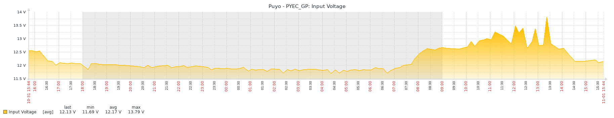
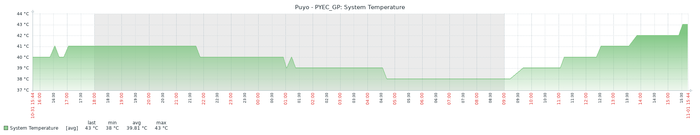

# <p align="center">GPS NetRS with Zabbix

<p align="center">This project aims to monitor the health status of GPS NetRS receivers using Zabbix.</p>

##

[](https://www.python.org/)
[](https://www.zabbix.com/)
[](https://github.com/rotoapanta/botZabbixPackage/issues)


[](https://www.gnu.org/licenses/gpl-2.0)
[](link_to_license) 

[](https://discord.gg/Gs9b3HFd)
[](https://www.docker.com/)
[](https://github.com/rotoapanta/gpsNetRsProject.git)
[](https://www.linux.org/)
[](https://www.microsoft.com/)
[](#installation)
[](link_to_tests)
[](https://www.linkedin.com/in/roberto-carlos-toapanta-g/)
[](#change-log)

# Contents

- [Getting started](#getting-started)
  - [Getting started with Zabbix and Telegram](#getting-started-with-zabbix-and-telegram)
  - [Features](#features)
  - [Requirements](#requirements)
  - [Components Description](#components-description)
- [Installation](#installation)
- [Configuration](#configuration)
- [Running the Application](#running-the-application)
- [Running the Project Automatically with Crontab](#running-the-project-automatically-with-crontab)
- [Environment Variables](#environment-variables)
- [Change Log](#change-log)
- [Running Tests](#running-tests)
- [Usage/Examples](#usage-examples)
- [Feedback](#feedback)
  - [Support](#support)
  - [License](#license)
- [Authors](#authors)
- [More Info](#more-info)
- [Links](#links)

## Getting started

### Getting started with Zabbix and Telegram

GPS NetRS receivers are used in various applications, including geodetic surveying, GNSS data collection, and more. Monitoring their health and performance is essential to ensure the reliability of data they provide. This project leverages Zabbix, a popular monitoring solution, to help you keep an eye on your GPS NetRS devices.

Let’s get started!

### Features

- Retrieve various metrics from GPS NetRS devices.
- Send collected data to Zabbix for analysis.
- Easily schedule monitoring tasks using `crontab`.

### Requirements

Before you get started, make sure you have the following:

- Python 3.11 or higher installed on your system.
- [Anaconda](https://www.anaconda.com/) for creating and managing Conda environments.
- A Zabbix server for storing and analyzing the collected data.
- Basic knowledge of using `crontab` for scheduling tasks.
- GPS NetRS devices
- Computer running Anaconda on Windows, Linux or macOS (in this case macOS is used).

### Components Description

The project consists of the following components:

- gpsNetRsProject/
  - api/
    - __init__.py
    - api_zbx_processing.py
    - logs/
      - __init__.py
      - aaaa-mm-dd_gps_netrs.log
      - gps_netrs.log
    - templates/
      - zbx_export_templates.xml
    - test/
      - __init__.py
      - test_gps_netrs_project.py
    - utils/
      - __init__.py
      - utilities.py
  - config.ini
  - main.py
  - requirements.txt
  - run_gps_netrs.sh
  - setup.py
  - zabbix_sender.py

- `api/`: This package contains modules related to the project's API functionality.
  - `init.py`: An empty file that marks the directory as a Python package. 
  - `api_zbx_processing.py`: Module for processing Zabbix data through the API.
- `logs/`: Directory for storing log files.
  - `init.py`: An empty file that marks the directory as a Python package.
  - `aaaa-mm-dd_gps_netrs.log`: File is a project log that records events and errors.
  - `gps_netrs_crontab.log`: Log file that captures the execution details of the project's scheduled tasks.
- `templates/`: Directory for Zabbix templates.
- `test/`: Package for unit tests.
  - `init.py`: An empty file that marks the directory as a Python package.
  - `test_gps_netrs_project.py`: File contains unit tests for the GPS NetRS Project.
- `utils/`: Package for utility functions.
  - `init.py`: An empty file that marks the directory as a Python package.
  - `utilities.py`: Script containing reusable functions that provide common functionality for the project.
- `config.ini`: Project configuration file with project-specific details.
- `main.py`: The main script of the project, which likely contains the core logic.
- `requirements.txt`: A list of project dependencies, typically used for package management.
- `run_gps_netrs.sh`: A shell script for executing the project.
- `setup.py`: A script used for packaging and distribution of the project.
- `zabbix_sender.py`: A script responsible for sending data to Zabbix.

## Installation

1. Clone the repository to your local machine:

  ```bash
   git clone https://github.com/rotoapanta/gpsNetRsProject.git
  ```
2. Configure the project by editing the `config.ini` file.

## Configuration

1. Open the config.ini file in the project directory.

2. Configure the Zabbix credentials:
   - Set the `Zabbix URL` in the url field.
   - Enter your `Zabbix username` in the zabbix_user field.
   - Provide your `Zabbix password` in the zabbix_password field.
   - Enter your `Zabbix server` in the zabbix_server field.
   - Enter your `Zabbix port` in the zabbix_port field.

3. Configure the Digitizer credentials:
   - Set your username and password field under the `[digitizer_credentials]` section.

## Running the Application

The run_gps_netrs.sh shell script is used to set up the environment, activate the Conda environment, install dependencies, and execute the main project script. The script is responsible for the following tasks:

- Setting environment variables.
- Activating the Conda environment.
- Installing project dependencies.
- Validating the existence of directories and files.
- Navigating to the project directory.
- Running the main project script (main.py).

Please review the script's comments for details about its operation and make sure it points to the correct paths for your specific environment.

  ```plaintext
  Note: Ensure that the script has the necessary permissions to execute.
  ```

## Running the Project Automatically with Crontab

To automate the monitoring process, you can use crontab to schedule the execution of the script at specific intervals. The provided run_gps_netrs.sh shell script helps you set up the environment and run the project under cron. 

Here's how to configure and use crontab with the project:

1. Open the crontab configuration for your user by running the following command

  ```bash
   crontab -e
  ```
2. Add an entry to schedule the script to run at regular intervals. For example, to run the script every 10 minutes, add the following line:
  
  ```bash
   */10 * * * * bash /path/to/run_gps_netrs.sh >> /path/to/logs/gps_netrs_crontab.log 2>&1
  ```
Be sure to replace /path/to with the actual paths to the run_gps_netrs.sh script and the desired log file.

Save and exit the crontab editor.

The script will now run automatically at the specified intervals and log its output to the specified log file.

## Environment Variables

Before running the project, make sure to set the following environment variables:

- `zabbix_url` = http://your-zabbix-server/zabbix
- `zabbix_user` = your-zabbix-username
- `zabbix_password` = your-zabbix-password
- `username` = your-username
- `password` = your-password

## Change Log

* Revision: 1.4 - Refactor code
* Revision: 1.3 - Add test unit
* Revision: 1.2 - Add run_gps_netrs.sh
* Revision: 1.1 - Code cleaned.
* Revision: 1.0 - Initial commit

## Running Tests

- Provide instructions for running tests.





## Usage/Examples

To run the project manually, execute the following command:

  ```bash
   python main.py
  ```
For scheduling and automation, refer to the Scheduling with crontab section.

## Feedback

If you have any feedback, please reach out to us at robertocarlos.toapanta@gmail.com

## Support

For support, email robertocarlos.toapanta@gmail.com or join our Discord channel.

## License

[GPL v2](https://www.gnu.org/licenses/gpl-2.0)

## Autors

- [@rotoapanta](https://github.com/rotoapanta)

## More Info

* [Official documentation for py-zabbix](https://py-zabbix.readthedocs.io/en/latest/)
* [Install py-zabbix 1.1.7](https://pypi.org/project/pyzabbix/)

## Links

[](https://www.linkedin.com/in/roberto-carlos-toapanta-g/)
[](https://twitter.com/rotoapanta)

